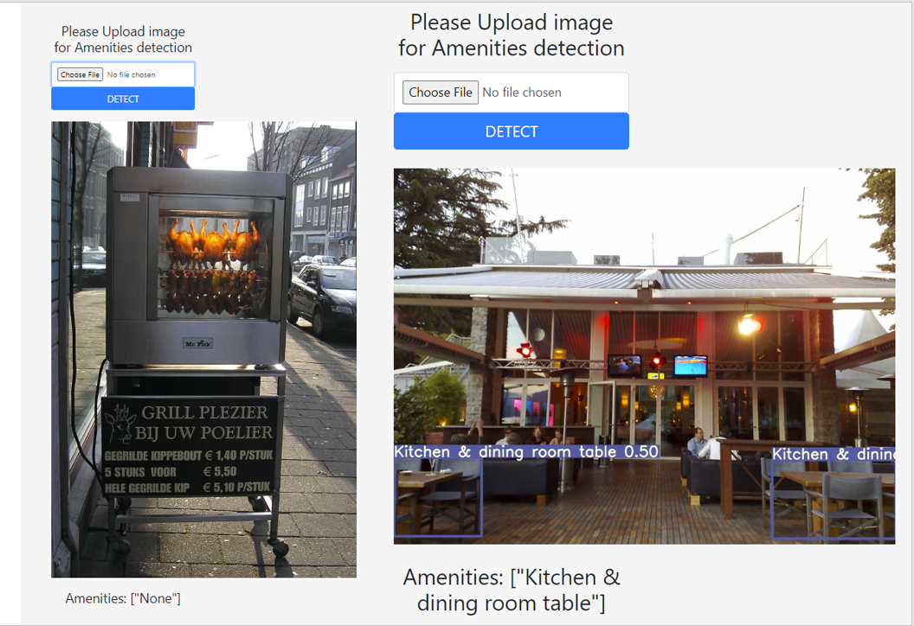

# AMENITY OBJECT DETECTION
This is one of my favorite project. After doing pyimagesearch gurus course, I wanted something more. 
I came across this [medium article by Airbnb](https://medium.com/airbnb-engineering/amenity-detection-and-beyond-new-frontiers-of-computer-vision-at-airbnb-144a4441b72e). 

### DESCRIPTION
This is a an end-to-end Pytorch based Object Detection that is hosted on Flask, allowing users to boot up a local web application and upload their own photos and see how many amenities are detected in their homes or photos. This project was built following needs and directions mentioned in this [Airbnb article](https://medium.com/airbnb-engineering/amenity-detection-and-beyond-new-frontiers-of-computer-vision-at-airbnb-144a4441b72e). 


### Project Goal
Develop an end to end machine learning product useful for business. 

## HOW TO USE THIS REPO:

#### REQUIREMENT
Python 3.8 or later with all requirements.txt dependencies installed, including torch>=1.6. To install run:

```$ pip install -r requirements.txt```


#### DATASET
- - - - - - -
First decide on the number and type of amenities we want to train. 
I decided here on 30 class amenities.
Downloaded images from [OPENIMAGES DATASET](https://storage.googleapis.com/openimages/web/index.html) using ```downloadOIO.py```
  * Collect the data according to needed amenities from openimages dataset
  * Download the respective .csv files from openimages dataset
  * Create a yaml file containing the location of training and validation images and class of our data contains

#### TRAINING 
- - - - - - -
##### PREPARE DATA
The main.py file is an executable that loads the .csv files (annotations and class id files) containing all image names and their related labels. The module munge_data converts bounding box data in csv files in .txt files as needed by YOLOv5. 
```
## download data, get the needed images ids and the bounding boxes information
python prepare.py
```
##### TRAIN THE DATA
Training done using Google Cloud platform using Tesla-P1000 GPU.
```
python train.py --img 640 
                --batch 8 
                --epochs 60 
                --data data/airbnb.yaml 
                --cfg models/yolov5x.yaml 
                --weights '' 
                --name yolov5x_airbnb_results 
                --cache
```
After training the model with random initialized weights (which took around 30hrs), I then trained using Yolo5x trained weights on COCO. The weights can be downloaded from google drive. This transfer learning had faster training - 15hrs and also better mAP.

##### TESTING
```
python test.py --weights runs/exp5_yolov5x_airbnb_results/weights/best.pt 
               --data airbnb.yaml 
               --img 672
               --save_txt
```

##### INFERENCE
```
python detect.py --weights runs/exp6_yolov5x_airbnb_results/weights/best.pt 
                 --source dataset/images/test/ 
                 --output output/inference_new 
                 --img 640 
                 --save-txt

## ENSEMBLE INFERENCE               
python detect.py --weights runs/exp5_yolov5x_airbnb_results/weights/best.pt runs/exp6_yolov5x_airbnb_results/weights/best.pt 
                --source dataset/images/test/ 
                --output output/inference_right_weights 
                --img 640 
                --save-txt

```

##### WEB APP
Now the most important part of end-to-end machine learning. Developing an interface to use this machine learning model. I develop FLASK API which can be seen below.
Then I wanted to develop a web App using heroku, but couldn't. The main reason being, I couldn't access the trained model weights from github releases and also when heroku install all the requirements, it exceeds the 512mb limit. So skipping it for now.
FLASK API
```
python detect_flask.py
python detect_imgae.py
```
If you want try the API app, download the weights from releases and this ```detect_imgae.py``` file and utils folder. Run the app locally on your machine. It looks as below.


As you can see from above, the model recognizes good number of objects like swimming pool, couch, sofa bed, kitchen and dinning table but it couldn't recognize the grill. 




I want to thank from bottom of my heart to the Daniel Bourke, Abhisekh Thakur, Eugene Yan and most important YOLOv5 Ultra Analytics. I learned a lot from them for this project.
[](https://doi.org/10.5281/zenodo.3983579)
